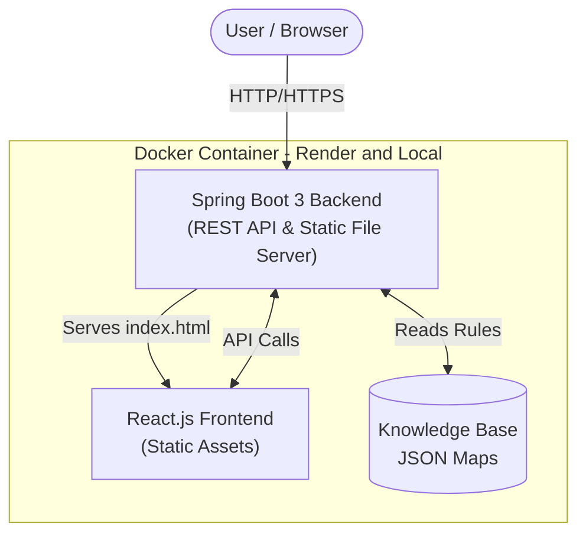
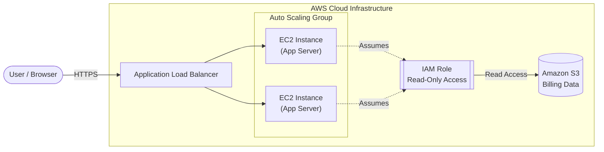

# CloudCostLens Architecture

This document outlines both the **Local/Deployment Architecture** used for the live demo and the **Cloud Design Architecture** modeled using Terraform.

## 1. Local & Deployment Architecture (Single Container)

To maximize free-tier hosting efficiency (e.g., on Render), the application uses a **Monolithic Container Pattern**. The React frontend compiles into static assets which are then served directly by the Spring Boot backend inside a single Docker container.

**Benefits of this approach:**
- **Cost-Effective:** Requires only one free-tier web service instance.
- **Simplified Deployment:** No need to configure CORS or manage separate deployments for frontend and backend.
- **Portability:** The exact same image runs identically on an engineer's local machine and in the cloud.

---

## 2. Cloud Production Architecture (Design)

While the live demo runs in a single container, a real-world enterprise deployment on AWS would distribute these components. The `terraform/` directory models this conceptual production architecture.

### Terraform Resources Modeled
The existing Terraform manifests (`terraform/main.tf`) define the foundational pieces of this architecture:
- **`aws_instance`**: The EC2 instance(`t2.micro`) serving as the application host.
- **`aws_s3_bucket`**: Secure storage bucket for hypothetical AWS billing data.
- **`aws_iam_role`**: A restrictive IAM role allowing the EC2 instances to read from the S3 bucket safely.

*(Note: These Terraform configurations are provided for design and validation only. They are not intended to be applied unless you wish to incur AWS charges).*
