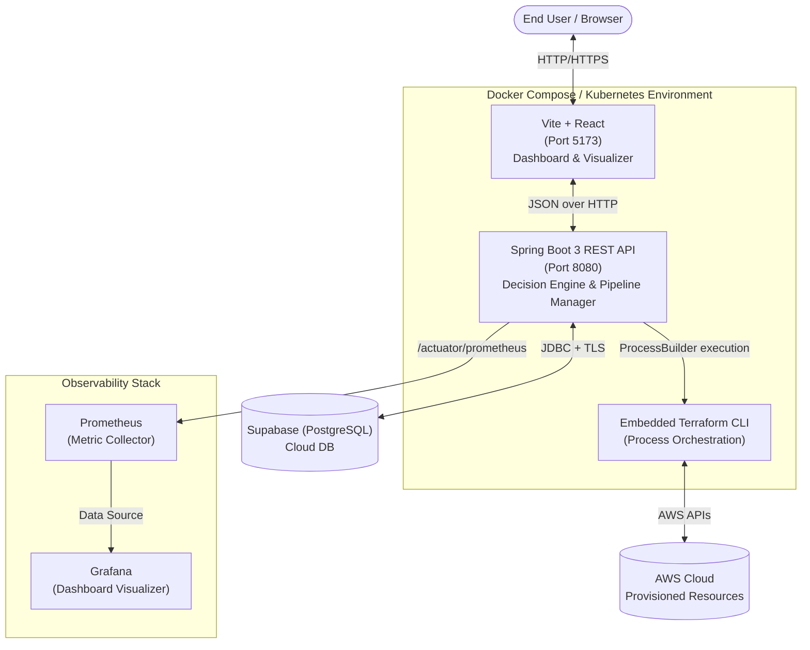
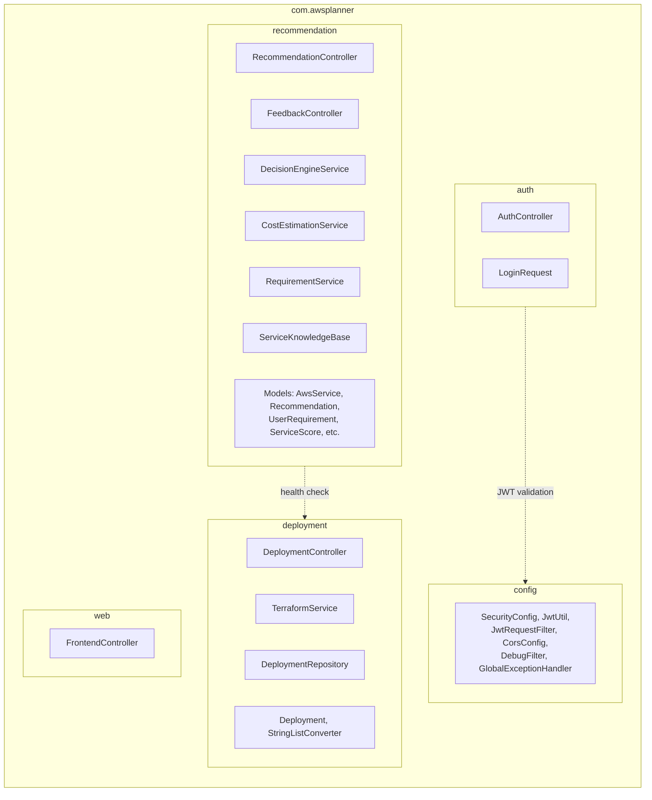
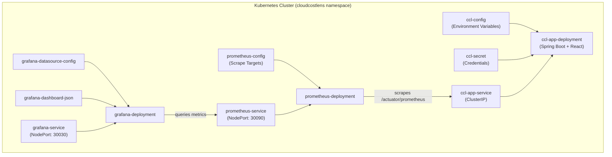
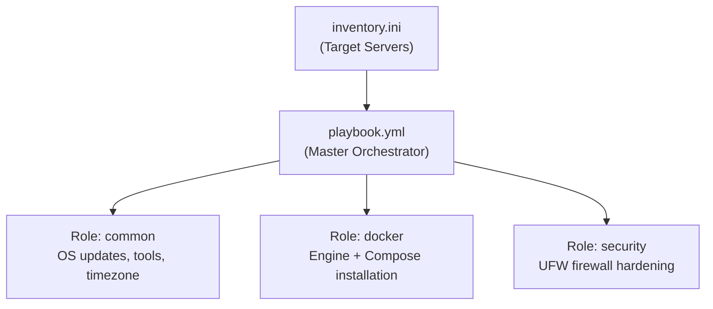

# CloudCostLens — Systems Architecture

This document provides a detailed look at how CloudCostLens is designed internally. It covers the application stack, the backend module structure, the cloud provisioning engine, and the DevSecOps infrastructure that ties everything together.

---

## 1. Platform Architecture

CloudCostLens runs as a containerized stack, orchestrated locally via Docker Compose and deployed to production via Kubernetes. The application communicates with a cloud-hosted Supabase database for persistence and interacts with AWS through an embedded Terraform engine.

### Component Roles
| Component | Role |
|---|---|
| **Frontend** | Interactive UI for requirement input, architecture visualization, and deployment tracking. |
| **Backend** | Core business logic — evaluates requirements, scores services, manages Terraform processes. |
| **Terraform CLI** | Executes infrastructure provisioning against AWS via `ProcessBuilder`. |
| **Supabase** | Cloud-hosted PostgreSQL for authentication records and deployment history. |
| **Prometheus** | Scrapes application metrics from the `/actuator/prometheus` endpoint every 15 seconds. |
| **Grafana** | Renders real-time dashboards for JVM health, HTTP traffic, CPU, and database connections. |

---

## 2. Backend Module Architecture (Modular Monolith)

The Spring Boot backend follows a **domain-aligned modular monolith** structure. Each module encapsulates its own controllers, services, models, and repositories within a single deployable unit.

### Module Boundaries
| Module | Responsibility | Dependencies |
|---|---|---|
| `auth` | JWT login and token management | Uses `config.JwtUtil` |
| `recommendation` | Architecture scoring, cost estimation, feedback | Uses `deployment.TerraformService` (health check only) |
| `deployment` | Terraform lifecycle (`init → plan → apply → destroy`) | Self-contained |
| `config` | Security filters, CORS, exception handling | Framework-level only |
| `web` | SPA route forwarding for React | None |

---

## 3. Cloud Provisioning Architecture

When a user approves a recommendation, CloudCostLens generates Terraform variables and applies one of three optimized modules.

### Supported Topologies

#### Scalable App Module (`scalable_app`)
For high-traffic, enterprise-grade applications:
- **Application Load Balancer (ALB)** for traffic distribution.
- **Auto Scaling Group (ASG)** spanning multiple Availability Zones.
- **EC2 Launch Templates** using the latest Amazon Linux 2023 AMI (resolved dynamically via SSM Parameter Store).

#### Web App Module (`web_app`)
For low-traffic or MVP backend deployments:
- Standalone EC2 instance with a strict ingress Security Group.

#### Storage App Module (`storage_app`)
For static assets or data-lake foundations:
- Private Amazon S3 bucket configuration.

### Automatic Lifecycle Management
Every successful provisioning triggers a background `ThreadPoolTaskScheduler` that automatically runs `terraform destroy` after **2 hours**, preventing runaway cloud costs during evaluations.

---

## 4. DevSecOps Pipeline Architecture

The Jenkins pipeline enforces security at every stage of the software delivery lifecycle:

```mermaid
flowchart LR
    A[Checkout] --> B[SAST\nSemgrep]
    B --> C[Build\nBackend]
    C --> D[SCA\nDependency-Check]
    D --> E[Build\nFrontend]
    E --> F[SCA\nnpm audit]
    F --> G[IaC Validate\nTerraform]
    G --> H[IaC Scan\nCheckov]
    H --> I[Docker\nBuild]
    I --> J[Push to\nRegistry]
    J --> K[Container Scan\nTrivy]
    K --> L[Deploy to\nKubernetes]
    L --> M[DAST\nOWASP ZAP]
```

### Security Scan Coverage
| Phase | Tool | Target |
|---|---|---|
| Pre-Build | Semgrep | Source code patterns |
| Post-Build | Dependency-Check, npm audit | Third-party libraries |
| Infrastructure | Terraform validate, Checkov | IaC misconfigurations |
| Pre-Deploy | Trivy | Container image vulnerabilities |
| Post-Deploy | OWASP ZAP | Running application (injection, XSS) |

---

## 5. Kubernetes Deployment Architecture

The application runs in a dedicated `cloudcostlens` namespace with the following resources:

---

## 6. Ansible Automation Architecture

Ansible automates server configuration through modular, reusable roles:

---

## 7. Performance Engineering & Load Testing

To ensure the platform can handle real-world traffic, we perform automated load testing using **k6**. The testing focuses on the backend's ability to handle concurrent requests and identify infrastructure breaking points.

### Load Testing Setup
- **Tool**: [k6](https://k6.io/)
- **Target Environment**: Render (Production-like)
- **Scenarios**: Baseline, Concurrent Load, and Ramp-Up Stress tests.

### Test Results

#### A. Baseline Test (Single User)
- **Configuration**: 1 VU, Single Iteration.
- **Outcome**: ~470ms average response time. Confirms basic connectivity and low-latency response under zero load.

#### B. Concurrent Load Test (Standard Traffic)
- **Configuration**: 1,000 VUs for 1 minute.
- **Throughput**: **~1,216 requests/second**.
- **Performance**: Average response time ~791ms.
- **Success Rate**: ~98.6% (minor connection refusals at peak).
- **Insight**: The backend handles significant concurrent traffic stably without a dedicated load balancer.

#### C. Ramp-Up Stress Test (Extreme Traffic)
- **Configuration**: Gradual increase (500 -> 1,000 -> 3,000 VUs).
- **Breaking Point**: System becomes unstable at ~3,000 VUs.
- **Observations**: Latency spikes to 60s, 100% failure rate due to request timeouts and infrastructure saturation.

### Bottleneck Analysis
Testing identified the following constraints:
1. **Infrastructure Limits**: Render free/starter tier CPU/Memory saturation.
2. **Horizontal Scaling**: Single backend instance reached its connection limit.
3. **Caching**: Absence of a Redis/Memcached layer leads to repetitive database queries.

### Scalability Insights
- The current architecture is stable for **500–1,000 concurrent users**.
- Future optimizations will include enabling **Kubernetes Horizontal Pod Autoscaling (HPA)** and integrating a **Redis caching layer** for frequently accessed recommendation data.

