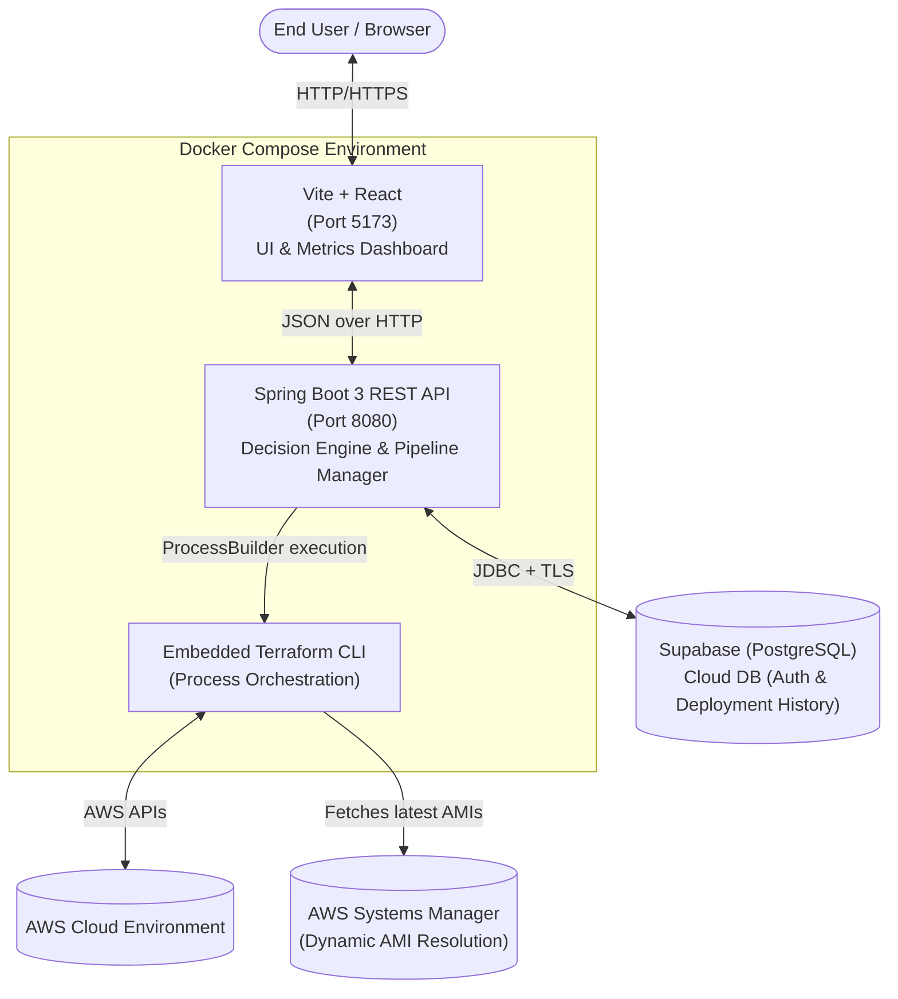
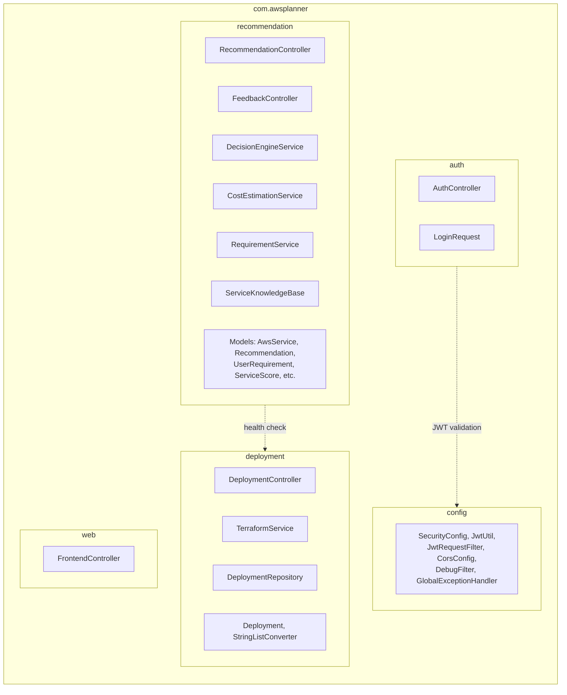

# CloudCostLens Systems Architecture

This document details the internal design of the CloudCostLens platform, separating the **Local/Deployment Platform Architecture** from the **Cloud Provisioning Architecture** that it orchestrates.

---

## 1. Platform Architecture (Dockerized Stack)

CloudCostLens operates using a distributed, containerized microservices architecture orchestrated via Docker Compose.

### Key Components:
- **Frontend (Vite/React):** A responsive, high-performance UI serving the real-time pipeline visualizer and architecture dashboard.
- **Backend (Spring Boot):** The intelligent core evaluating user requirements against the AWS Service Knowledge Base. Also manages external Terraform `Process` instances natively.
- **Persisted Volumes:** Terraform state and generated variables are saved securely to a local volume (`/app/terraform/workspaces`), ensuring complete recovery and state integrity during container restarts.
- **Supabase Cloud:** Instead of a local fragile DB, history and authentication are persisted across environments using Supabase (PostgreSQL).

---

## 1.1 Backend Module Architecture (Modular Monolith)

The Spring Boot backend follows a **domain-aligned modular monolith** structure. Each module encapsulates its own controllers, services, models, and repositories within a single deployable unit.

### Module Boundaries:
| Module | Responsibility | Cross-module Dependencies |
|---|---|---|
| `auth` | JWT login, token management | Uses `config.JwtUtil` |
| `recommendation` | Architecture scoring, cost estimation, feedback | Uses `deployment.TerraformService` (health check only) |
| `deployment` | Terraform lifecycle (init → plan → apply → destroy) | Self-contained |
| `config` | Security filters, CORS, exception handling | Framework-level, no domain imports |
| `web` | SPA route forwarding | None |

---

## 2. Cloud Provisioning Architecture (Modular Infrastructure as Code)

When a deployment is triggered, CloudCostLens generates variables and applies one of its highly-optimized **Terraform Modules**.

### Supported Topologies

#### 1. Scalable App Module (`scalable_app`)
Designed for high-traffic, decoupled enterprise applications.
- **Application Load Balancer (ALB)** distributing traffic strictly to instances.
- **Auto Scaling Group (ASG)** spanning multiple Availability Zones.
- **EC2 Launch Templates** dynamically requesting the latest **Amazon Linux 2023** AMI via AWS Systems Manager Parameter Store to avoid AMI expiration rot.
- *Failsafe:* ASGs are equipped with `force_delete = true` to guarantee clean teardowns and prevent orphan AWS charges.

#### 2. Web App Module (`web_app`)
Designed for low-traffic or initial MVP backend deployments.
- Standalone EC2 instance protected by a strict ingress Security Group.
- Publicly accessible via HTTP/TCP.

#### 3. Storage App Module (`storage_app`)
Designed for static assets or data-lake foundational layers.
- Private Amazon S3 bucket architecture.

### Automatic Lifecycle Management
To ensure this platform remains cost-neutral during evaluations, the Spring Backend employs a `ThreadPoolTaskScheduler`. Every successful provision initiates a background countdown timer that will forcibly trigger `terraform destroy` after **2 hours**, tearing down all cloud infrastructure.
